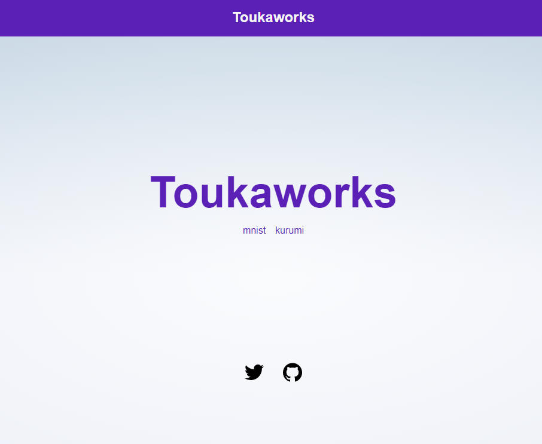
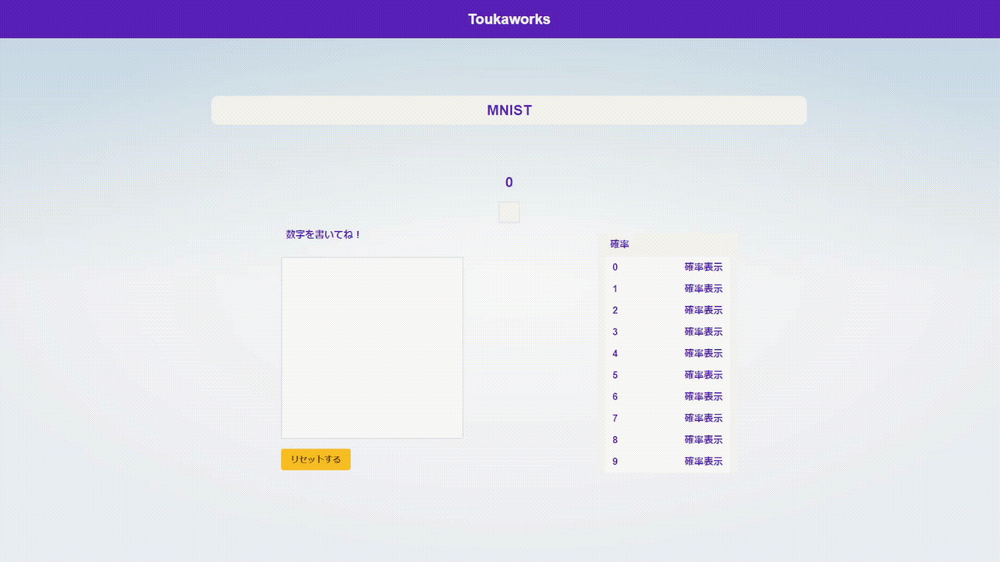

# これはなに？

気が向いたら作成される作品を飾るための場所です。

## 開発環境

- svelte - 3.54.0
- nodejs - 18.12.1
- typescript - 4.9.3
- tensorflow.js - 4.1.0

## つくったもの

  

    
 <strong> メインページ  </strong>   かわいいですね 

    
  

  
 <strong> MNIST </strong>   数字を書くと判定します 

    

